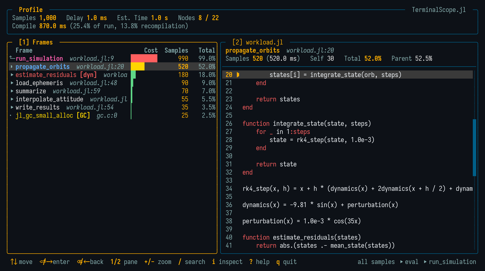

<p align="center">
  <br>
</p>

# TerminalScope.jl

[](https://github.com/ronisbr/TerminalScope.jl/actions/workflows/ci.yml)
[][docs-stable-url]
[][docs-dev-url]
[](https://github.com/ronisbr/TerminalScope.jl/blob/main/LICENSE.txt)

The **TerminalScope.jl** provides an interactive terminal user interface (TUI) to
diagnose the performance of Julia code.

<p align="center">
  
</p>

It bundles four analyses under one macro and one consistent drill-down interface:

- **Runtime profile**: where the time is spent, from the sampling profiler;
- **Allocation profile**: where the memory is allocated, including what was allocated;
- **Inference profile**: where the compiler spends its time inferring types;
- **Invalidations**: which method definitions invalidate previously compiled code.

On top of those, a **type-instability inspector** — in the spirit of `Cthulhu.@descend` —
shows the source code annotated with the inferred types and lets the user descend through
the call sites, directly from any profiled frame.

## Installation

This package can be installed using:

```julia-repl
julia> using Pkg
julia> Pkg.add("TerminalScope")
```

## Usage

All the analyses are reached through the macro `@scope`, whose first argument selects
the mode:

```julia
using TerminalScope

@scope f(x)                          # Runtime profile (default mode).
@scope allocs f(x)                   # Allocation profile.
@scope inference f(x)                # Type-inference profile.
@scope invalidations using SomePkg   # Method invalidations.
@scope descend f(x)                  # Type-instability inspector.
```

Each mode opens a full-screen viewer that takes over the terminal until the user quits
with the `q` key. The main view shows the frame list on the left and the source code of
the selected row — updated live while navigating — on the right. The viewers support
the mouse (the wheel scrolls the hovered panel and a click selects a row), vim-style
navigation keys, and whole-tree frame search with the `/` key. Press `?` inside the
viewer for the complete set of key bindings.

## Documentation

For more information, see the [documentation][docs-stable-url].

[docs-dev-url]: https://ronisbr.github.io/TerminalScope.jl/dev
[preferences-url]: https://github.com/JuliaPackaging/Preferences.jl
[docs-stable-url]: https://ronisbr.github.io/TerminalScope.jl/stable
