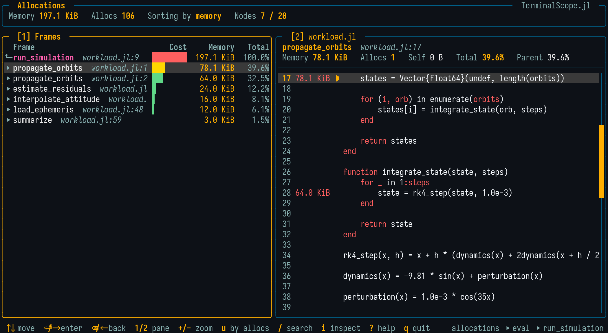

# Allocation Profile

```@meta
CurrentModule = TerminalScope
```

The `allocs` mode of [`@scope`](@ref) runs an expression under the allocation profiler
(`Profile.Allocs`) and opens the viewer with the tree of allocation sites:

```julia
@scope allocs [sample_rate = 1.0] [warmup = true] expr
```

The expression is first executed once as a warm-up, so its compilation happens **before**
the recording starts, and then executed again under the profiler. The value of `expr` is
discarded.

The following options are available:

- `sample_rate`: Fraction of the allocations recorded by the profiler. With the default
  `1.0`, every allocation is recorded and the shown bytes and counts are exact; with a
  smaller value, they are the recorded fraction.
  (**Default**: `1.0`)
- `warmup`: If `true`, run `expr` once before profiling it.
  (**Default**: `true`)

!!! warning

    The warm-up run means `expr` is executed twice. Pass `warmup = false` when its side
    effects must happen only once — and, in that case, consider a lower `sample_rate`:
    profiling a first call at full rate records a stack trace for every allocation of the
    compiler itself, which can take many minutes and look like a hang.

## The Viewer



The tree is ranked by **allocated bytes** and the header shows the totals of both units.
Pressing `u` re-ranks the whole tree by **allocation counts** (and back), recomputing
every percentage and cost bar, so both the "few huge buffers" and the "many small
allocations" problems are easy to spot.

Pressing `s` switches to the flat self-time view, ranking the allocating call sites of
the whole tree by their aggregated cost: the costs of the allocated-type leaves are
charged to the allocating source frame, so the flat list answers "which line of my code
allocates" directly.

Descending past the deepest frame of a branch lists the **allocated types**
(`Vector{Float64}`, `String`, ...) as leaves with their own costs, so the viewer shows
not only where the allocation happened but also what was allocated.

To keep the tree readable:

- Compiler-mangled names are demangled (keyword bodies like `#f#123` become `f`, and
  anonymous functions are shown as `λ#37`);
- Pure keyword wrapper frames (`kwcall` and same-named keyword bodies) are collapsed;
- The C runtime allocator frames at the leaf side of the stacks are stripped, so
  branches bottom out at the allocating Julia frame.

## Per-Line Costs in the Source Panel

In the allocation viewer, the source panel gains a heat-colored column between the line
numbers and the code with the cost charged to each line, following the active unit.
Within a file, each allocation is charged only to the innermost frame of that file, so
caller lines stay clean while user files are still credited for allocations that bottom
out inside Base.

## Viewing Collected Data

```julia
scope_allocs()         # Uses `Profile.Allocs.fetch()`.
scope_allocs(results)  # Uses an `AllocResults` collected before.
```

## Examples

```julia-repl
julia> using TerminalScope

julia> @scope allocs my_workload()

julia> @scope allocs sample_rate = 0.01 cold_workload()

julia> @scope allocs warmup = false push_to_global_state!()
```
