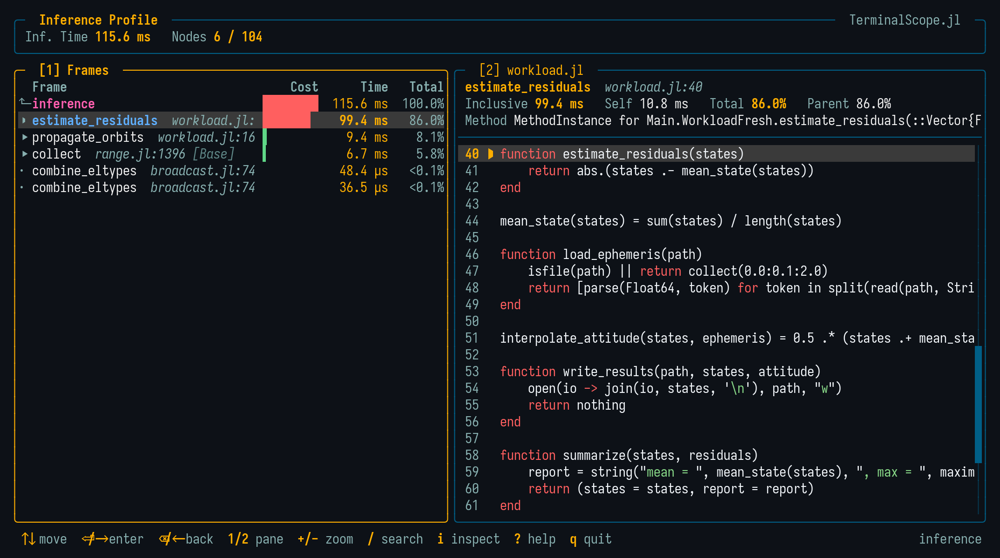

# Inference Profile

```@meta
CurrentModule = TerminalScope
```

The `inference` mode of [`@scope`](@ref) profiles Julia's type inference while an
expression runs, using `SnoopCompileCore.@snoop_inference`, and opens the viewer with
the inference timing tree:

```julia
@scope inference expr
```

The frame costs are shown as inference plus LLVM compilation times, and the tree can be
navigated exactly like a runtime profile. The value of `expr` is discarded.



The times scale automatically from minutes down to microseconds and nanoseconds, so fast
inference frames keep a meaningful cost instead of rounding to zero.

Like the runtime profile, the viewer supports the flat self-time view (`s`) and, on
graphics terminals, draws a flame graph of the inference tree along the bottom of the
screen (see [Flame Graph](@ref man_flame_graph)).

!!! note

    To capture the inference cost of the first call, `expr` must contain code that has
    not been compiled yet. Run this mode in a fresh session for representative results.

## Viewing Collected Data

```julia
scope_inference(tinf)
```

opens the viewer for the timing tree `tinf` returned by
`SnoopCompileCore.@snoop_inference`.

## Examples

```julia-repl
julia> using TerminalScope

julia> @scope inference my_uncompiled_pipeline()

julia> tinf = SnoopCompileCore.@snoop_inference first_call();

julia> scope_inference(tinf)
```
