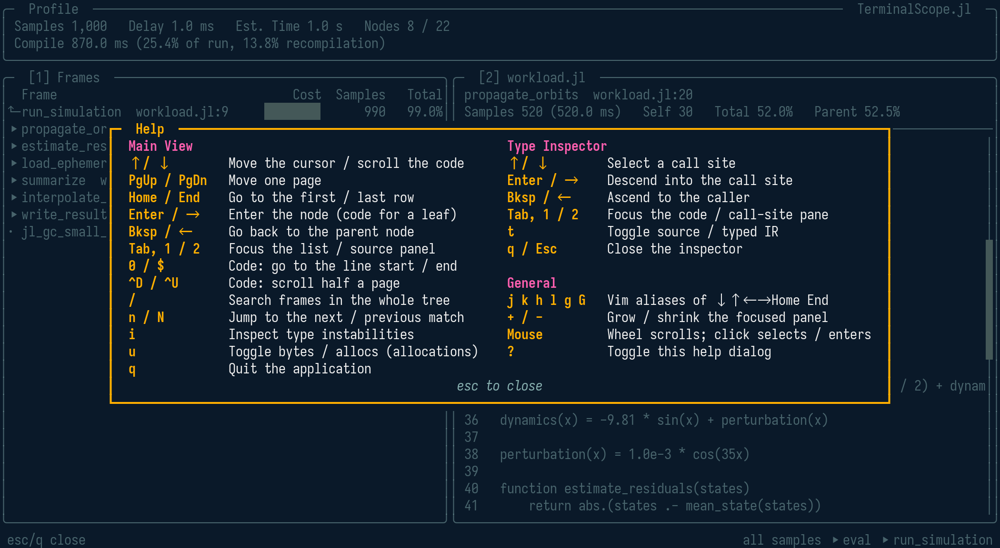
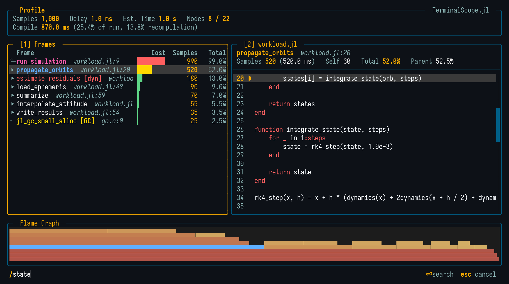
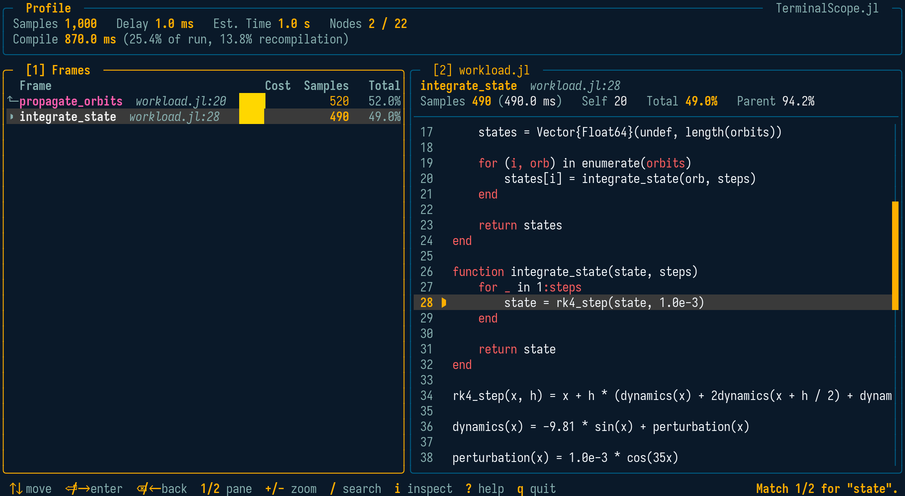
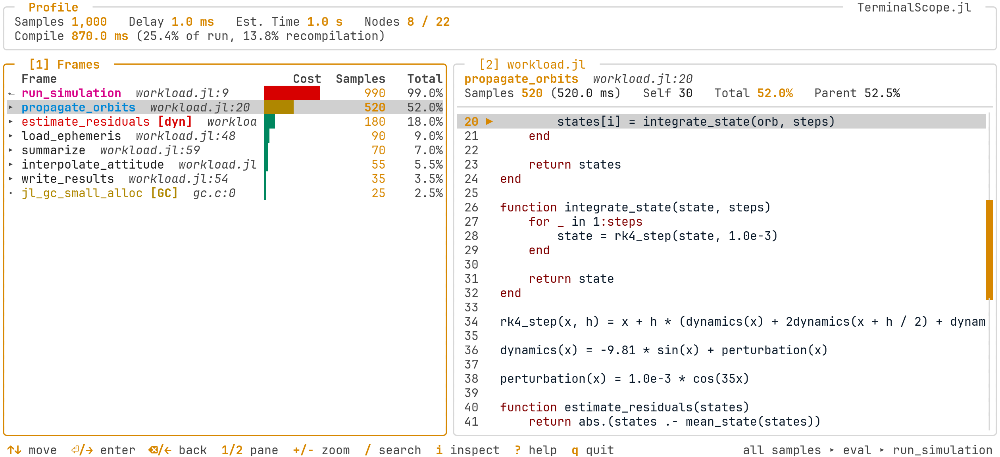

# [Navigation and Themes](@id man_navigation)

```@meta
CurrentModule = TerminalScope
```

## The Main View

Every profile viewer shares the same layout: the frame list on the left and the source
panel on the right, updated live while navigating.

- **`[1] Frames`**: One level of the tree at a time — the current node as a pinned parent
  row (`⬑`) followed by its children, sorted by cost. Entering a node auto-descends
  through single-child chains until the next branching point, and going back inverts the
  auto-descent in one key press.
- **`[2] Source`**: A compact information strip (name, tags, costs, and method signature)
  above the syntax-highlighted source of the selected row, with the frame line marked
  with `▶`.
- **Flame Graph**: On terminals supporting a graphics protocol (Kitty graphics or
  Sixel), a flame graph of the whole profile is drawn along the bottom of the screen
  (see [Flame Graph](@ref man_flame_graph)).

The panels are numbered like in LazyGit: the number keys jump straight to a panel, and
the movement keys act on the focused one.

| Keys              | Action                                                        |
|:------------------|:--------------------------------------------------------------|
| `↑` / `↓`         | Move the cursor (list) or scroll the code (source panel)      |
| `j` `k` `h` `l` `g` `G` | Vim-style aliases of `↓` `↑` `←` `→` `Home` `End`       |
| `PgUp` / `PgDn`   | Move or scroll one page                                       |
| `Home` / `End`    | Go to the first / last row, or the top / bottom of the code   |
| `Enter` / `→`     | Enter the node; on a leaf, focus the source panel             |
| `Bksp` / `←`      | Go back to the parent node                                    |
| `Tab`, `1` / `2`  | Switch or jump the panel focus                                |
| `+` / `-`         | Maximize / restore the focused panel                          |
| `0` / `$`         | Source panel: go to the line start / end                      |
| `^D` / `^U`       | Source panel: scroll half a page                              |
| `/`               | Search frames in the whole tree (case-insensitive regex)      |
| `n` / `N`         | Jump to the next / previous search match                      |
| `s`               | Toggle the flat self-time view                                |
| `f`               | Toggle the flame-graph panel (graphics terminals)             |
| `e`               | Open the selected frame in the editor                         |
| `i`               | Inspect the selected frame for type instabilities             |
| `u`               | Allocations: toggle between bytes and allocation counts       |
| `?`               | Toggle the help dialog                                        |
| `q`               | Quit                                                          |

The status bar always shows the most important bindings of the active view, and the `?`
dialog lists all of them:



## Mouse

The mouse is supported as well: the wheel scrolls the panel under the cursor — moving
the selection in the lists and the view in the code panes — and a left click focuses the
clicked panel, moving the selection to the clicked row. Clicking the selected row again
enters it, and a click closes the help dialog.

Over the flame-graph panel, a click selects the clicked frame rectangle in the frame
list — and clicking the selected rectangle again enters it — while the wheel ascends and
descends the tree.

## [Flame Graph](@id man_flame_graph)

When the terminal supports a graphics protocol — Kitty graphics (Kitty, Ghostty) or
Sixel (WezTerm, iTerm2, foot, mlterm) — the runtime, allocation, and inference viewers
draw a flame graph of the **whole profile** along the bottom of the screen: the root at
the bottom, the call stacks growing upward, and each frame's width proportional to its
inclusive cost.

The colors carry the measurements and the navigation state:

- Each frame is heat-colored by its share of the total cost, on a muted ramp from sand
  (cheap) through amber to brick red (hot), adapted to the dark and light themes.
- The row selected in the frame list is filled with the theme primary color (cyan), so
  the flame graph always shows where the selection sits in the global picture.
- The path from the root to the current drill-down level is drawn at full heat with a
  bright line along its lower edge, and the current subtree keeps its full heat, while
  the rest of the tree is dimmed toward the background.

When the tree is deeper than the panel fits, a dashed strip along the top edge signals
the truncated levels. The `f` key hides and restores the panel, and it disappears
automatically while a panel is maximized with `+`. On terminals without graphics
support, the panel is hidden entirely and the viewers keep the two-panel layout.

## Flat Self-Time View

The frame list ranks frames by their *inclusive* cost while drilling down. Pressing `s`
switches it to a flat list of the hottest frames of the **whole tree** ranked by their
aggregated *self* cost — the cost spent in the frame itself, excluding its callees —
which is the classic way to find the hot leaf functions of a profile.

Occurrences of the same frame (same function, file, and line) anywhere in the tree merge
into one row. `Enter` jumps back into the tree view at the hottest occurrence of the
selected row, and `s` or `Backspace` return to the saved tree position. In the
allocation viewer, the costs of the synthetic allocated-type leaves are charged to the
allocating call site, so the flat view answers "which line of my code allocates"; the
`u` unit toggle re-ranks the flat rows in place. The invalidations viewer has no flat
view, since its counts are not a cost distribution.

## Jump to Editor

Pressing `e` opens the selected frame — or, inside the type inspector, the inspected
method — in the user's editor at the exact file and line, suspending the interface while
the editor runs and restoring it afterwards. The editor is resolved like `Base.edit`,
from `$JULIA_EDITOR`, `$VISUAL`, or `$EDITOR`. Editors that return immediately (e.g.
GUI editors like VS Code) bring the viewer right back while the file opens in the
background.

## Frame Search

Pressing `/` opens a search prompt in the status bar, styled after the Neovim command
line:



Confirming with `Enter` collects every frame of the **whole profile tree** whose name or
source location matches the query and navigates the viewer to the first match —
descending or ascending levels as needed, with the cursor placed on the matching row.
The query is a case-insensitive regular expression, so `^step!$` matches a frame name
exactly and `solve|integrate` matches either name; a query that is not a valid pattern
(e.g. an unbalanced `[`) falls back to a plain case-insensitive substring match. `n` and
`N` then cycle through the matches, wrapping around, while the status bar reports the
current position:



`Esc` cancels the prompt without searching, and `Backspace` edits the query while it is
open. Since the search covers the entire tree, it is the fastest way to answer "where is
my function in this profile" without descending manually.

## Themes

The viewers ship with a dark and a light theme, matching the SatelliteAnalysis.jl
presentation palette: navy structure, amber chrome, cyan data emphasis, and magenta
secondary emphasis.

The default variant is `:dark`. It can be changed for the session:

```julia
TerminalScope.theme!(:light)
```

or per invocation, since every function entry point accepts a `theme` keyword:

```julia
scope_profile(g; theme = :light)
```



### Customizing the Colors

Every color of both variants can be overridden through
[Preferences.jl](https://github.com/JuliaPackaging/Preferences.jl):

```julia
# Colors accept an xterm-256 code (0-255) or a hex string (quantized to xterm-256).
TerminalScope.set_theme_color!(:dark, :accent, "#38BDF8")
TerminalScope.set_theme_color!(:light, :bg, 255)

# The :selection slot is the background of the row under the cursor.
TerminalScope.set_theme_color!(:dark, :selection, 236)

# Restore the default palette of both variants.
TerminalScope.reset_theme_colors!()
```

The available slots are `:bg`, `:border`, `:border_focus`, `:text`, `:text_dim`,
`:text_bright`, `:primary`, `:secondary`, `:accent`, `:success`, `:warning`, `:error`,
`:title`, and `:selection`. The overrides are stored in the `LocalPreferences.toml` file
of the active project and take effect after restarting Julia.

## Reference

```@docs
theme!
set_theme_color!
reset_theme_colors!
THEME_SLOTS
THEME_DEFAULTS
SELECTION_DEFAULTS
```
