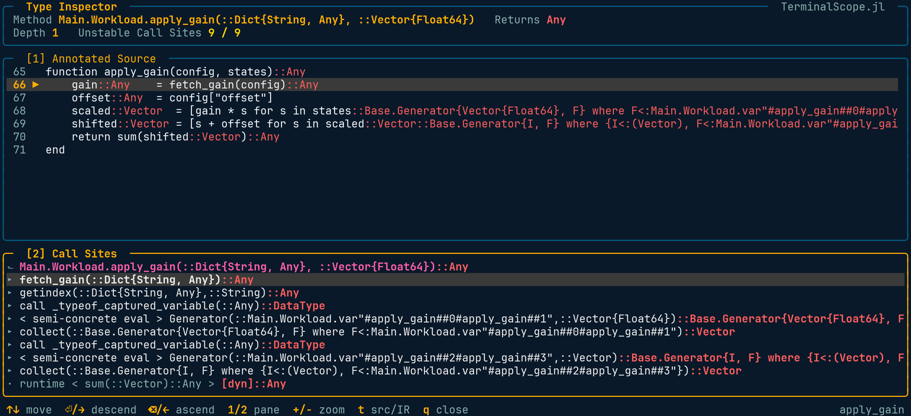

# [Type Inspector](@id man_type_inspector)

```@meta
CurrentModule = TerminalScope
```

The type-instability inspector shows a method's source code annotated with the inferred
types — in the spirit of `Cthulhu.@descend` — and lets the user descend through its call
sites. It can be entered in two ways:

1. Pressing `i` on any frame of a viewer whose row carries a method instance;
2. Directly, through the `descend` mode:

```julia
@scope descend f(x, y)
```

The call is **not** executed; only its argument types are used to select the inspected
method specialization. The function form takes the argument types explicitly:

```julia
scope_descend(f, Tuple{Int, Float64})
```

!!! note

    The inspector is backed by Cthulhu, which is loaded automatically on the first use
    (with a status notice, since it takes a moment). Loading Cthulhu invalidates
    compiled code of unrelated packages, which is why it is not loaded before it is
    needed.

## The Viewer



The top pane shows the **annotated source** of the inspected method: the inferred types
are attached to the expressions whose type is not concrete, colored by stability using
the theme colors (which adapt to the light variant):

- **Error color (coral)**: An abstract type — the classic type instability;
- **Warning color (gold)**: A small `Union`, which Julia usually handles well;
- **Primary color (cyan)**: A concrete (stable) type.

The `t` key toggles the pane to the **typed IR** (the `@code_warntype`-like view), which
is also used automatically when the source cannot be mapped (e.g. generated functions).

The bottom pane lists the **call sites** of the method with their inferred return types,
colored by the same convention. Union-split call sites list each target as a sub-entry
(`↳`), and dynamic dispatches are tagged with `[dyn]`. The source pane highlights and
centers the line of the selected call site.

- `Enter` / `→` descends into the selected call site;
- `Backspace` / `←` ascends back to the caller;
- `q` / `Esc` closes the inspector, returning to the view it was opened from.

The header shows the inspected method, its inferred return type, the descend depth, and
how many call sites are type-unstable.

## Examples

```julia-repl
julia> using TerminalScope

julia> unstable(x) = x > 0 ? 1 : 2.0;

julia> caller(x) = unstable(x) + 1;

julia> @scope descend caller(1)
```
